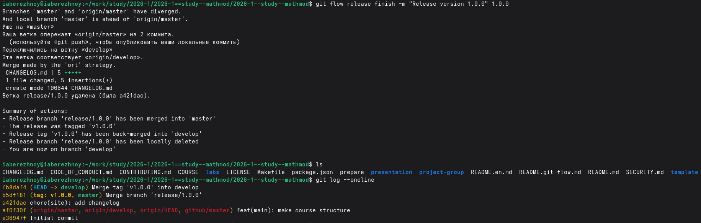
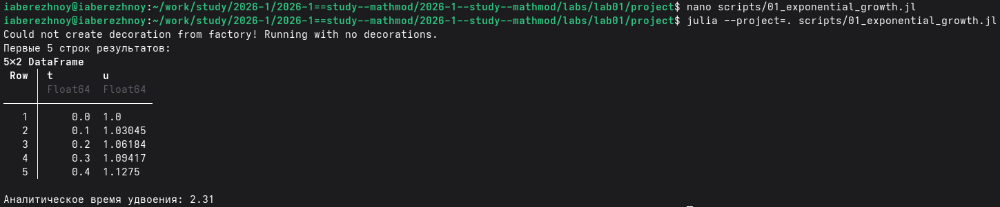
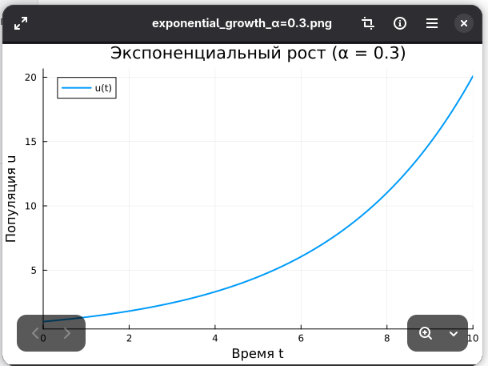

---
## Author
author:
  name: Иван Александрович Бережной
  email: 1132236041@rudn.ru
  affiliation:
    - name: Российский университет дружбы народов
      country: Российская Федерация
      postal-code: 117198
      city: Москва
      address: ул. Миклухо-Маклая, д. 6
## Title
title: "Презентация по лабораторной работе №1"
subtitle: "Математическое моделирование"
license: CC BY
date: today
date-format: "YYYY-MM-DD" # Example: 2025-09-06
---

# Информация

## Докладчик

  * Иван Александрович Бережной
  * студент
  * Российский университет дружбы народов им. П. Лумумбы
  * 1132236041@rudn.ru

::: notes
- Представиться.
:::

# Вводная часть

## Актуальность

- Вычислительный эксперимент должен быть воспроизводимым.
- Код, ноутбук и текст отчёта легко расходятся, если вести их отдельно.
- Литературное программирование даёт один источник для всех трёх.
- Подготовленный стенд используется во всех следующих работах курса.

::: notes
- Главная мысль: один файл, из которого получается всё остальное.
:::

## Объект и предмет исследования

- Объект: математическая модель экспоненциального роста популяции.
- Предмет: организация эксперимента с этой моделью средствами языка Julia.

::: notes
- Модель простая, она здесь пример, на котором отрабатывается сам процесс.
:::

## Цели и задачи

- Цель:
    - Установить рабочий стенд, приобрести навыки создания проектов на Julia.
- Задачи:
    - Создать рабочий каталог курса и проект DrWatson.
    - Реализовать модель в литературном стиле и получить из неё код, ноутбук и документацию.
    - Исследовать модель на наборе параметров.

::: notes
- Задачи обобщены: в методичке их больше, здесь они сгруппированы в три.
:::

## Материалы и методы

Работа выполнялась на виртуальной машине, созданной с помощью VirtualBox на ОС Fedora.

Программное обеспечение:

- git, gh, git-flow.
- Node.js, pnpm, commitizen, standard-version.
- Julia с DrWatson, DifferentialEquations, Plots, Literate.
- Quarto, TeX Live.

Методы: численное решение ОДУ (Tsit5), сравнение с аналитическим решением, параметрическое сканирование.

::: notes
- GitVerse в качестве основного хранилища, GitHub в качестве зеркала.
- Tsit5: явный метод Рунге-Кутты 5-го порядка с адаптивным шагом.
:::

# Выполнение работы

## Настройка git

- Заданы имя, почта, начальная ветка `master`, обработка концов строк.
- Создан ключ SSH (ed25519) и добавлен в GitVerse и GitHub.
- Создан ключ GPG (RSA 4096) и включена подпись коммитов.
- Установлены git-flow, commitizen, cz-customizable, standard-version.

::: notes
- SSH нужен для доступа к репозиторию, GPG для подтверждения авторства коммитов.
- commitizen оформляет сообщения коммитов по единому стандарту.
- standard-version по этим сообщениям ведёт номер версии и журнал изменений.
:::

## Рабочий каталог курса и релиз

- Репозиторий создан из шаблона и клонирован в `~/work/study/`.
- Сформирована структура курса, инициализирован git-flow.
- Выпущен релиз `v1.0.0`.

{width=85%}

::: notes
- git-flow: ветка `master` для релизов, `develop` для разработки.
- Ветка релиза влита в обе, создана метка `v1.0.0`.
- Релиз опубликован на GitVerse и на GitHub.
:::

## Проект DrWatson

- Проект создан скриптом `setup_project.jl`, пакеты добавлены скриптом `add_packages.jl`.
- Единая структура каталогов:
    - `scripts/` --- скрипты расчётов;
    - `data/` --- результаты;
    - `plots/` --- графики;
    - `notebooks/`, `markdown/` --- ноутбуки и документация.
- Функции `datadir()`, `plotsdir()` дают пути независимо от места запуска.

::: notes
- DrWatson отвечает за воспроизводимость: окружение с версиями пакетов и предсказуемые пути.
- `@quickactivate` активирует окружение проекта из любого скрипта.
:::

## Модель экспоненциального роста

$$
\frac{du}{dt} = \alpha u, \quad u(0) = u_0
$$

- Аналитическое решение $u(t) = u_0 e^{\alpha t}$
- Время удвоения: $T_2 = \dfrac{\ln 2}{\alpha}$

::: notes
- Скорость роста пропорциональна текущему значению.
- Время удвоения не зависит от начального значения.
:::

## Реализация модели

- Скрипт `scripts/01_exponential_growth.jl`.
- Параметры: $u_0 = 1$, $\alpha = 0.3$, $t \in [0, 10]$, шаг сохранения 0.1.
- Решение: `solve(prob, Tsit5(), saveat=0.1)`.

{width=90%}

::: notes
- Скрипт выводит первые строки таблицы и время удвоения, сохраняет график и данные.
:::

## Литературное программирование

- Проект создан с пакетом DrWatson.
- Один файл `.jl`, код и пояснения в комментариях.
- Строка `# текст` становится текстом документа, остальное остаётся кодом.
- Скрипт `tangle.jl` получает из него: чистый код, ноутбук и документ Quarto для отчёта.

::: notes
- Код, ноутбук и текст отчёта из одного источника.
- Преобразование выполняет пакет Literate.jl.
:::

## Производные форматы

:::::::::::::: {.columns align=center}
::: {.column width="45%"}

- `scripts/` --- чистый код.
- `notebooks/` --- ноутбук Jupyter.
- `markdown/` --- документ Quarto.
- Ноутбук выполнен, результаты совпадают со скриптом.

:::
::: {.column width="55%"}

:::
::::::::::::::

::: notes
- Документ Quarto подключён в отчёт командой include, код выполняется при сборке отчёта.
- Для этого в `_quarto.yml` включена поддержка Julia, в преамбуле подключён шрифт JuliaMono.
:::

## Модель с набором параметров

- Скрипт `scripts/02_exponential_growth.jl`.
- Параметры собраны в `Dict`, расчёт вынесен в функцию.
- `dict_list` строит все комбинации параметров.
- `produce_or_load` сохраняет результат и не пересчитывает его повторно.
- Добавлен бенчмаркинг для каждого значения $\alpha$.

::: notes
- Сканирование по $\alpha$: 0.1, 0.3, 0.5, 0.8, 1.0.
- Остальные параметры фиксированы.
:::

# Результаты

## Решение при $\alpha = 0.3$

:::::::::::::: {.columns align=center}
::: {.column width="45%"}

- $u(10) = 20.09$
- Время удвоения: 2.31
- Совпадает с $e^{3}$

:::
::: {.column width="55%"}

:::
::::::::::::::

::: notes
- График получен первым скриптом и сохранён в директории `plots`.
:::

## Параметрическое сканирование

|$\alpha$|$u(10)$|Время удвоения|
|---:|---:|---:|
|0.1|2.71828|6.93147|
|0.3|20.0854|2.31049|
|0.5|148.409|1.38629|
|0.8|2980.57|0.866434|
|1.0|22021.0|0.693147|

Отклонение от $e^{\alpha t}$ не более 0.03%.

::: notes
- Наибольшее отклонение при $\alpha = 1.0$: 22021.0 против точного 22026.5.
- Причина: допуски решателя по умолчанию.
:::

## Сравнение траекторий

{width=75%}

::: notes
- Чем больше $\alpha$, тем быстрее рост: при 1.0 значение на четыре порядка больше, чем при 0.1.
- На линейной шкале кривые для малых $\alpha$ прижаты к оси.
:::

## Время удвоения

{width=65%}

::: notes
- Точки: результаты расчёта, пунктир: теоретическая кривая $\ln 2 / \alpha$.
- Точки лежат на кривой: увеличение $\alpha$ в 10 раз уменьшает время удвоения в 10 раз.
:::

## Точность и время расчёта

- Численное решение согласуется с аналитическим.
- Погрешность растёт с $\alpha$: от $10^{-4}$% при 0.1 до 0.02% при 1.0.
- Причина: ошибка метода накапливается при допусках по умолчанию.
- Время одного расчёта около $2.4 \cdot 10^{-5}$ с и почти не зависит от $\alpha$.

::: notes
- Погрешность можно уменьшить, задав решателю более жёсткие допуски `abstol` и `reltol`.
- В выводе программы время округлено до 0.0 с, реальные значения видны на графике в отчёте.
:::

# Заключение

## Главный вывод

Рабочее пространство подготовлено, навыки создания и преобразования программы на Julia получены: один литературный файл даёт код, ноутбук и текст отчёта, а численное решение совпадает с аналитическим.

::: notes
- Поблагодарить устно и перейти к вопросам.
:::

