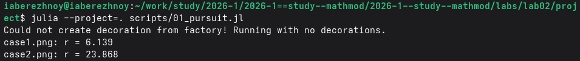
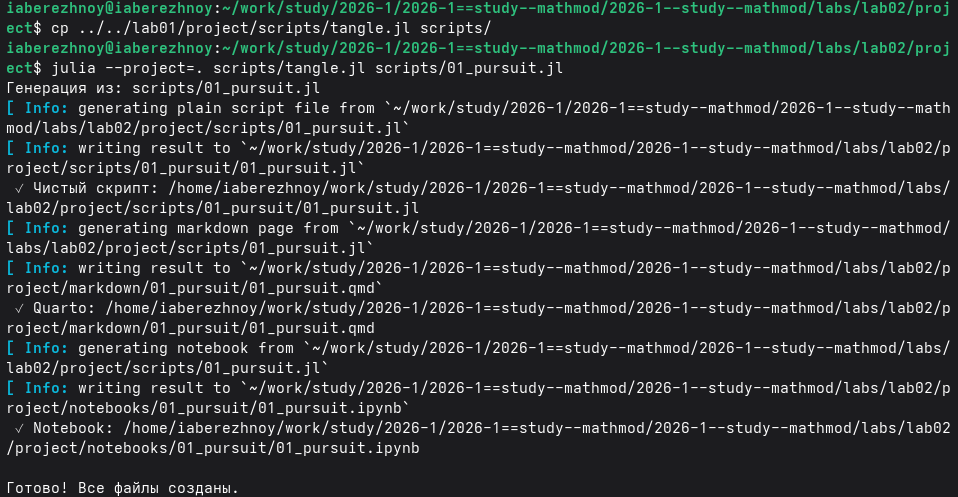
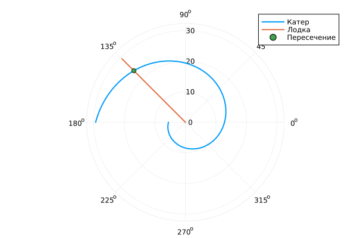

---
## Author
author:
  name: Иван Александрович Бережной
  email: 1132236041@rudn.ru
  affiliation:
    - name: Российский университет дружбы народов
      country: Российская Федерация
      postal-code: 117198
      city: Москва
      address: ул. Миклухо-Маклая, д. 6
## Title
title: "Презентация по лабораторной работе №2"
subtitle: "Математическое моделирование"
license: CC BY
date: today
date-format: "YYYY-MM-DD" # Example: 2025-09-06
---

# Информация

## Докладчик

  * Иван Александрович Бережной
  * студент
  * Российский университет дружбы народов им. П. Лумумбы
  * 1132236041@rudn.ru

::: notes
- Представиться.
:::

# Вводная часть

## Актуальность

- Модель помогает выбрать стратегию, которая будет работать в любом случае.
- Задачи поиска и преследования часто встречаются на практике.

::: notes
- Модель даёт траекторию, а не угадывает направление.
:::

## Объект и предмет исследования

- Объект: задача о погоне катера за лодкой.
- Предмет: траектория катера, по которой он точно догонит лодку.

## Цели и задачи

- Цель:
    - Построить модель задачи о погоне и решить её на Julia.
- Задачи: 
    - Записать уравнение движения катера и начальные условия для двух случаев.
    - Построить траектории катера и лодки.
    - Найти точку пересечения траекторий.

## Материалы и методы

Работа выполнялась на виртуальной машине с ОС Fedora.

Методы:

- Построение модели в полярных координатах.
- Численное решение дифференциального уравнения.
- Сравнение с точным решением.

# Выполнение работы

## Стратегия катера

Центр координат: точка, где заметили лодку. Сначала катер идёт прямо, пока не окажется на том же расстоянии от центра, что и лодка, затем идёт по спирали, удаляясь от центра со скоростью лодки.

::: notes
- Случаев два: лодка ушла навстречу катеру или от него.
:::

## Уравнение траектории

$$
\frac{dr}{d\theta} = \frac{r}{\sqrt{n^2 - 1}}
$$

- Случай 1: $\theta_0 = 0$, $r_0 = k/(n+1) = 3.286$
- Случай 2: $\theta_0 = -\pi$, $r_0 = k/(n-1) = 5.552$

::: notes
- Радиальная скорость равна скорости лодки, остаток по теореме Пифагора.
:::

## Реализация модели

- Проект создан пакетом DrWatson.
- Скрипт `scripts/01_pursuit.jl` в литературном стиле.
- Функция `pursuit` решает уравнение и строит график.

{width=100%}

::: notes
- Программа выводит расстояние до точки встречи
:::

## Производные форматы

Скрипт `tangle.jl` получает чистый код, ноутбук и Quarto, который подключается в отчёте.

{width=70%}

# Результаты

## Случай 1

Встреча на расстоянии 6.139 км.

{height=65%}

## Случай 2

Встреча на расстоянии 23.868 км.

{height=65%}

# Заключение

## Главный вывод

Катер догоняет лодку при любом направлении её движения: на расстоянии 6.139 км в первом случае и 23.868 км во втором.

::: notes
- Поблагодарить устно и перейти к вопросам.
:::

