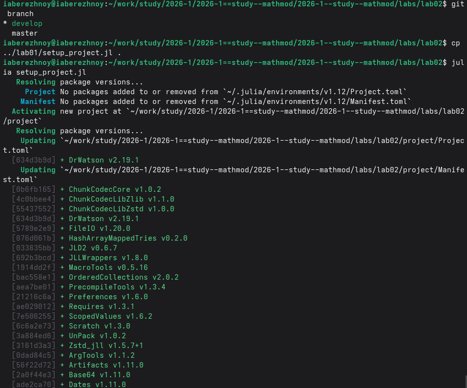
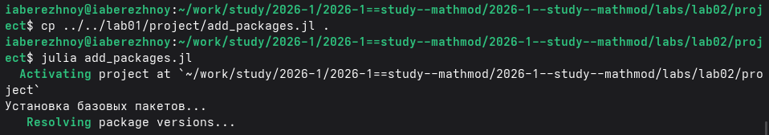
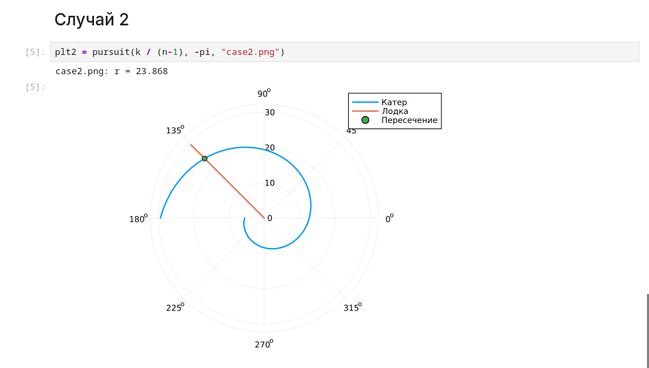
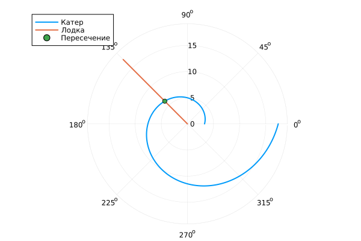

---
## Author
author:
  name: Иван Александрович Бережной
  email: 1132236041@rudn.ru
  affiliation:
    - name: Российский университет дружбы народов
      country: Российская Федерация
      postal-code: 117198
      city: Москва
      address: ул. Миклухо-Маклая, д. 6
## Title
title: "Отчёт по лабораторной работе №2"
subtitle: "Математическое моделирование"
license: "CC BY"
abstract: |
  В отчёте представлено решение задачи о погоне. 
  
keywords: [лабораторная работа, Julia, задача о погоне]
---

# Введение

## Цель работы

Построить модель задачи о погоне и решить её на Julia.

## Задачи

Номер варианта: $(1132236041 \bmod 70) + 1 = 42$.

Условие: катер береговой охраны преследует лодку. Лодку заметили на расстоянии 16.1 км от катера, после чего она ушла по прямой в неизвестном направлении. Катер быстрее лодки в 3.9 раз.

- Записать уравнение движения катера и начальные условия для двух случаев.
- Построить траектории катера и лодки.
- Найти точку пересечения траекторий.

## Объект и предмет исследования

Объект исследования --- задача о погоне катера за лодкой.

Предмет --- траектория катера, по которой он точно догонит лодку.

## Методы исследования

- Построение модели в полярных координатах.
- Численное решение дифференциального уравнения.
- Сравнение с точным решением.

## Схема выполнения работы

На рис. -@fig-flowchart представлена общая последовательность действий при выполнении работы.


::: {#fig-flowchart}

```{mermaid}
%%| fig-width: 100%
graph TD
    A@{ shape: circle, label: "Начало" } --> B[Вывести уравнение]
    B --> C[Создать проект]
    C --> D[Написать скрипт]
    D --> E[Построить графики]
    E --> F[Сделать отчёт]
    F --> G@{ shape: dbl-circ, label: "Конец" }
```

Блок-схема выполнения лабораторной работы

:::

# Теоретическая часть

Рассуждения взяты из методических указаний [@mathmod_lab02].

Обозначим: $k$ --- начальное расстояние, $v$ --- скорость лодки, $nv$ --- скорость катера. Центр координат --- точка, где заметили лодку.

Сначала катер идёт прямо, пока не окажется на том же расстоянии от центра, что и лодка. Это расстояние зависит от того, куда пошла лодка: навстречу катеру или от него:

$$
x_1 = \frac{k}{n + 1}, \qquad x_2 = \frac{k}{n - 1}.
$$

Дальше катер идёт по спирали вокруг центра и удаляется от него с той же скоростью, что и лодка. Так он пересечёт её путь в любом направлении. Для этого движения получается уравнение

$$
\frac{dr}{d\theta} = \frac{r}{\sqrt{n^2 - 1}}.
$$

Его точное решение:

$$
r = r_0 \exp\left(\frac{\theta - \theta_0}{\sqrt{n^2 - 1}}\right).
$$

# Выполнение лабораторной работы

Создадим проект DrWatson (рис. -@fig-001).

{#fig-001 width=100%}

Добавим в проект пакеты (рис. -@fig-002).

{#fig-002 width=100%}

Напишем скрипт `scripts/01_pursuit.jl`. Он решает уравнение, находит точку пересечения и строит график. Код скрипта представлен в приложении. Запустим его (рис. -@fig-003).

{#fig-003 width=100%}

Получим из скрипта чистый код, ноутбук и Quarto (рис. -@fig-004).

{#fig-004 width=100%}

Выполним ноутбук (рис. -@fig-005).

{#fig-005 width=100%}

# Результаты

Траектории для первого случая показаны на рис. -@fig-006, для второго --- на рис. -@fig-007.

{#fig-006 width=100%}

{#fig-007 width=100%}

Точки пересечения приведены в табл. -@tbl-result.

| Случай | Угол | Расстояние, км |
|:--:|:--:|:--:|
|1|$3\pi/4$|6.139|
|2|$3\pi/4$|23.868|

: Точки пересечения траекторий {#tbl-result}

# Обсуждение результатов

Результаты программы совпадают с точным решением: по формуле получается 6.14 и 23.87 км.

Во втором случае катер догоняет лодку в 4 раза дальше, поскольку до пути лодки ему нужно пройти большой угол.

Точка встречи зависит от направления лодки, но катер догонит её в любом случае: спираль за один оборот пересекает все направления.

# Заключение

Модель построена и решена, найдены точки пересечения.

# Список литературы {.unnumbered}

::: {#refs}
:::

\appendix


