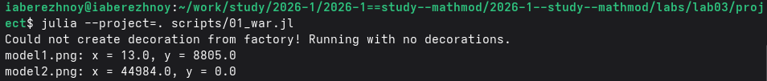
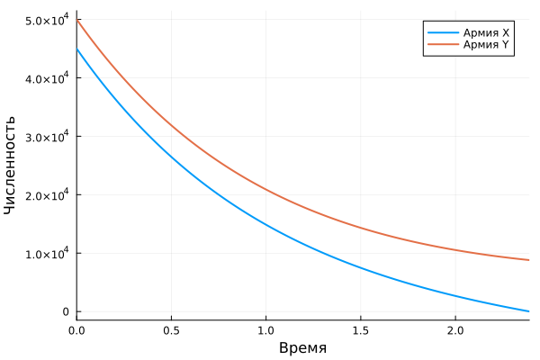

---
## Author
author:
  name: Иван Александрович Бережной
  email: 1132236041@rudn.ru
  affiliation:
    - name: Российский университет дружбы народов
      country: Российская Федерация
      postal-code: 117198
      city: Москва
      address: ул. Миклухо-Маклая, д. 6
## Title
title: "Презентация по лабораторной работе №3"
subtitle: "Математическое моделирование"
license: CC BY
date: today
date-format: "YYYY-MM-DD" # Example: 2025-09-06
---

# Информация

## Докладчик

  * Иван Александрович Бережной
  * студент
  * Российский университет дружбы народов им. П. Лумумбы
  * 1132236041@rudn.ru

::: notes
- Представиться.
:::

# Вводная часть

## Актуальность

- Модель позволяет заранее определить исход боя.

::: notes
- Исход зависит не только от численности, но и от эффективности/качественности армии.
:::

## Объект и предмет исследования

- Объект: боевые действия между двумя армиями.

- Предмет: изменение численности армий во времени.

## Цели и задачи

- Цель:
    - Построить модель боевых действий и решить её на Julia.
- Задачи: 
    - Построить графики численности армий для боя между регулярными войсками.
    - Построить графики численности армий для боя регулярных войск с партизанами.

## Материалы и методы

Работа выполнялась на виртуальной машине с ОС Fedora.

Методы:

- Построение модели в виде системы дифференциальных уравнений.
- Численное решение системы.
- Анализ графиков.

# Выполнение работы

## Модель

На численность каждой армии влияют 3 вещи:

- потери, не связанные с боем;
- потери в бою;
- подкрепление.

Проигрывает армия, численность которой первой упадёт до нуля.

::: notes
- В начале у армии X 45000, у армии Y 50000.
:::

## Случай 1: регулярные войска

$$
\frac{dx}{dt} = -0.29x - 0.67y + |\sin t + 1|
$$

$$
\frac{dy}{dt} = -0.6x - 0.38y + |\cos t + 1|
$$

## Случай 2: регулярные войска и партизаны

$$
\frac{dx}{dt} = -0.31x - 0.67y + 2|\sin 2t|
$$

$$
\frac{dy}{dt} = -0.42xy - 0.53y + |\cos t + 1|
$$

::: notes
- Потери партизан зависят от произведения численностей.
:::

## Реализация модели

Проект создан с помощью DrWatson, скрипт `scripts/01_war.jl` выполнен в литературном стиле.

{width=100%}

::: notes
- Программа выводит численность армий после боя.
:::

# Результаты

## Случай 1

Побеждает армия Y с оставшейся численностью 8805 человек.

{height=65%}

::: notes
- Армия X будет с численностью 0 к 2.39.
:::

## Случай 2

Побеждает армия X с оставшейся численностью 44984 человека.

{height=65%}

::: notes
- Партизаны исчезают практически моментально.
:::

# Заключение

## Главный вывод

В бою регулярных войск побеждает армия Y, в бою с партизанами побеждает армия X.

::: notes
- Поблагодарить устно и перейти к вопросам.
:::

