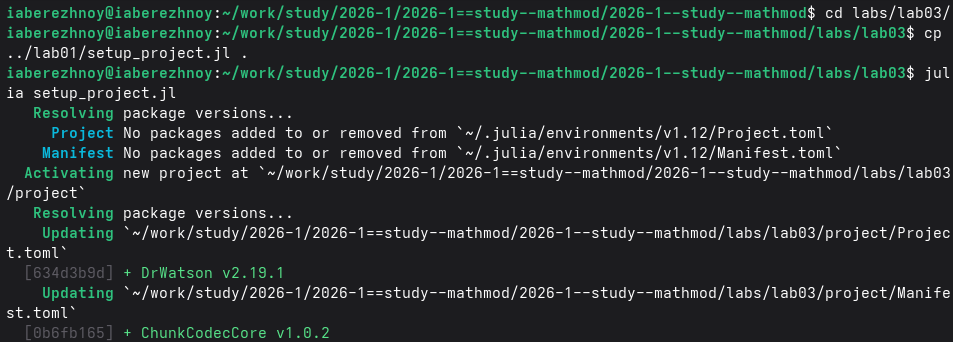
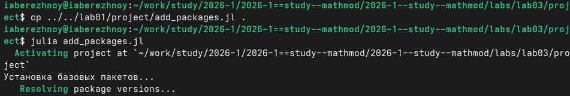
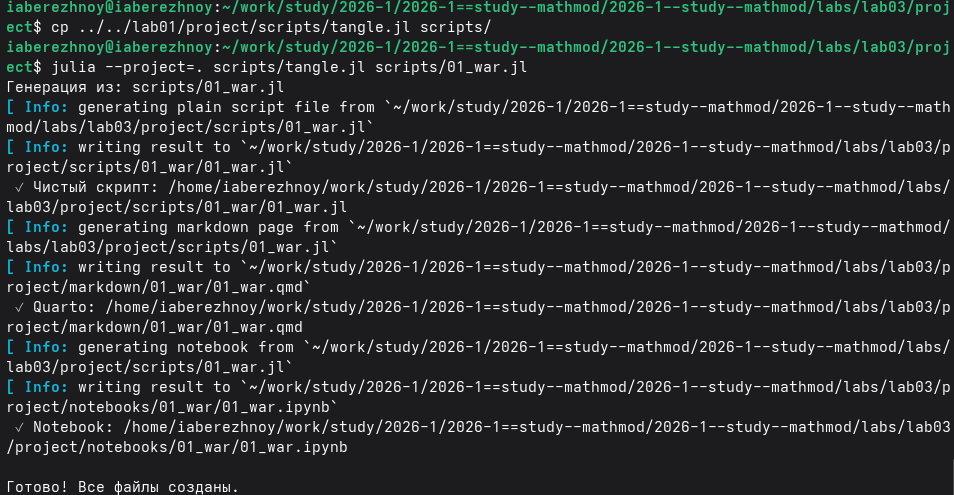
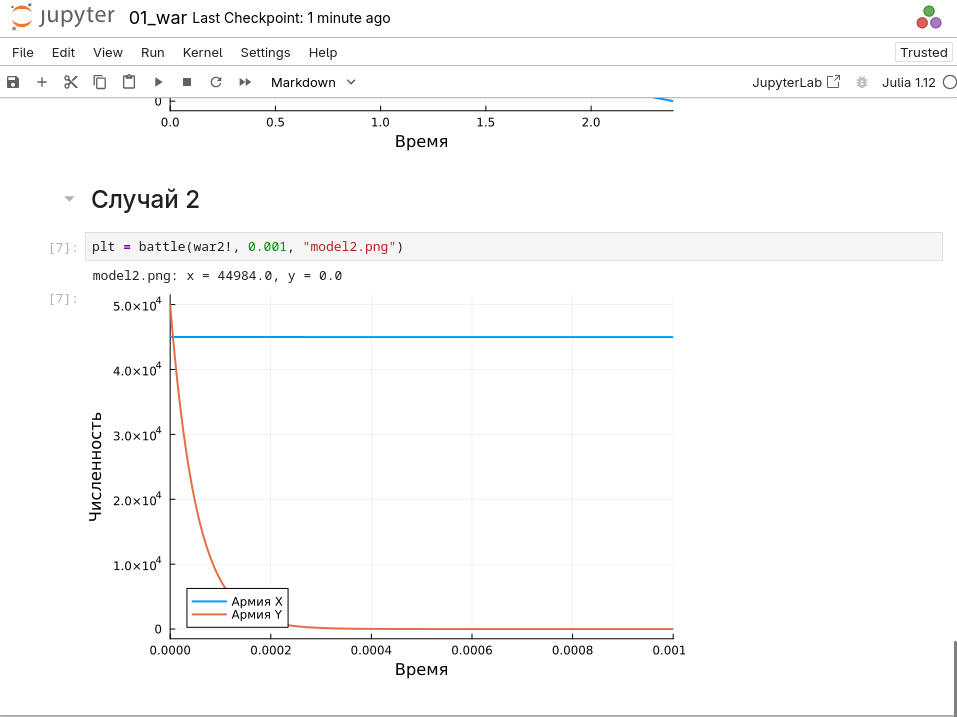
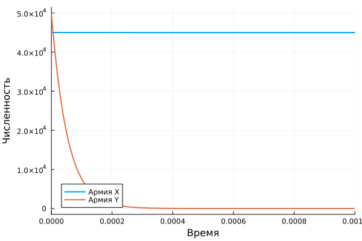

---
## Author
author:
  name: Иван Александрович Бережной
  email: 1132236041@rudn.ru
  affiliation:
    - name: Российский университет дружбы народов
      country: Российская Федерация
      postal-code: 117198
      city: Москва
      address: ул. Миклухо-Маклая, д. 6
## Title
title: "Отчёт по лабораторной работе №3"
subtitle: "Математическое моделирование"
license: "CC BY"
abstract: |
  В отчёте рассмотрена модель боевых действий.
  
keywords: [лабораторная работа, Julia, модель боевых действий]
---

# Введение

## Цель работы

Построить модель боевых действий и решить её на Julia.

## Задачи

Номер варианта: $(1132236041 \bmod 70) + 1 = 42$.

Условие: между двумя странами идёт война. В начале у армии X 45000 человек, у армии Y 50000.

- Построить графики численности армий для боя между регулярными войсками.
- Построить графики численности армий для боя регулярных войск с партизанами.

## Объект и предмет исследования

Объект --- боевые действия между двумя армиями.

Предмет --- изменение численности армий во времени.

## Методы исследования

- Построение модели в виде системы дифференциальных уравнений.
- Численное решение системы.
- Анализ графиков.

## Схема выполнения работы

На рис. -@fig-flowchart представлена общая последовательность действий при выполнении работы.

::: {#fig-flowchart}

```{mermaid}
%%| fig-width: 100%
graph TD
    A@{ shape: circle, label: "Начало" } --> B[Записать уравнения]
    B --> C[Создать проект]
    C --> D[Написать скрипт]
    D --> E[Построить графики]
    E --> F[Сделать отчёт]
    F --> G@{ shape: dbl-circ, label: "Конец" }
```

Блок-схема выполнения лабораторной работы

:::

# Теоретическая часть

Описание модели взято из методических указаний [@mathmod_lab03].

Обозначим $x$ и $y$ --- численности армий. На численность каждой армии влияют три вещи:

- потери, не связанные с боем;
- потери от противника;
- подкрепление.

Проигрывает армия, численность которой первой упадёт до нуля.

Случай 1. Обе армии регулярные:

$$
\frac{dx}{dt} = -0.29x - 0.67y + |\sin t + 1|
$$

$$
\frac{dy}{dt} = -0.6x - 0.38y + |\cos t + 1|
$$

Случай 2. Армия X регулярная, армия Y --- партизаны:

$$
\frac{dx}{dt} = -0.31x - 0.67y + 2|\sin 2t|
$$

$$
\frac{dy}{dt} = -0.42xy - 0.53y + |\cos t + 1|
$$

Во втором случае потери партизан зависят от произведения $xy$, потому что по ним бьют по площадям.

Начальные условия в обоих случаях: $x_0 = 45000$, $y_0 = 50000$.

# Выполнение лабораторной работы

Создадим проект DrWatson (рис. -@fig-001).

{#fig-001 width=100%}

Добавим в проект пакеты (рис. -@fig-002).

{#fig-002 width=100%}

Напишем скрипт `scripts/01_war.jl`. Он решает обе системы и строит графики. Код скрипта представлен в приложении. Запустим его (рис. -@fig-003).

{#fig-003 width=100%}

Получим из скрипта чистый код, ноутбук и Quarto (рис. -@fig-004).

{#fig-004 width=100%}

Выполним ноутбук (рис. -@fig-005).

{#fig-005 width=100%}

# Результаты

График для первого случая показан на рис. -@fig-006, для второго --- на рис. -@fig-007.

{#fig-006 width=100%}

{#fig-007 width=100%}

Численности армий в конце боя приведены в табл. -@tbl-result.

|Случай|Время|Армия X|Армия Y|Победитель|
|:--:|:--:|:--:|:--:|:--:|
|1|2.39|13|8805|Y|
|2|0.001|44984|0|X|

: Результаты расчёта {#tbl-result}

# Обсуждение результатов

В первом случае побеждает Y. У неё больше людей в начале.

Во втором случае побеждает X. Партизаны исчезают почти сразу.

# Заключение

Модель построена и решена, для обоих случаев получены графики.

# Список литературы {.unnumbered}

::: {#refs}
:::

\appendix


