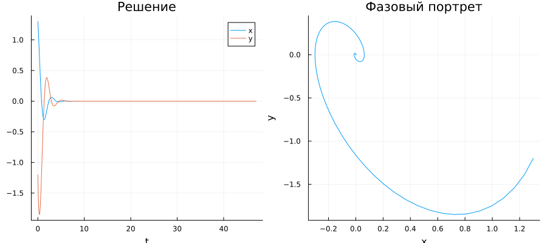

---
## Author
author:
  name: Иван Александрович Бережной
  email: 1132236041@rudn.ru
  affiliation:
    - name: Российский университет дружбы народов
      country: Российская Федерация
      postal-code: 117198
      city: Москва
      address: ул. Миклухо-Маклая, д. 6
## Title
title: "Презентация по лабораторной работе №4"
subtitle: "Математическое моделирование"
license: CC BY
date: today
date-format: "YYYY-MM-DD" # Example: 2025-09-06
---

# Информация

## Докладчик

  * Иван Александрович Бережной
  * студент
  * Российский университет дружбы народов им. П. Лумумбы
  * 1132236041@rudn.ru

::: notes
- Представиться.
:::

# Вводная часть

## Актуальность

- Одна и та же модель описывает разные колебания: маятник, груз на пружине, заряд в контуре.
- Модель показывает, как трение и внешняя сила меняют колебания.

## Объект и предмет исследования

- Объект: гармонический осциллятор.

- Предмет: изменение его состояния во времени.

## Цели и задачи

- Цель:
    - Построить модель гармонических колебаний и решить её на Julia.
- Задачи: 
    - Построить решение и фазовый портрет без затухания.
    - Построить решение и фазовый портрет с затуханием.
    - Построить решение и фазовый портрет с затуханием и внешней силой.

## Материалы и методы

Работа выполнялась на виртуальной машине с ОС Fedora.

Методы:

- Построение модели в виде системы дифференциальных уравнений.
- Численное решение системы.
- Анализ графиков и фазовых портретов.

# Выполнение работы

## Модель

Три случая:

$$
\ddot{x} + 14x = 0
$$

$$
\ddot{x} + 2\dot{x} + 5x = 0
$$

$$
\ddot{x} + 4\dot{x} + 5x = 0.5\cos(2t)
$$

::: notes
- Время от 0 до 47, в начале x = 1.3, y = -1.2.
:::

## Переход к системе

Вводим скорость $y = \dot{x}$ и получаем два уравнения первого порядка.

Фазовый портрет: по горизонтали $x$, по вертикали $y$.

::: notes
- Численный метод решает системы первого порядка.
:::

## Реализация модели

Проект создан с помощью DrWatson, скрипт `scripts/01_oscillator.jl` выполнен в литературном стиле.

{width=100%}

::: notes
- Программа выводит значения x и y в конце отрезка времени.
:::

# Результаты

## Случай 1: без затухания

Колебания не затухают, фазовый портрет замкнут.

{height=60%}

## Случай 2: с затуханием

Колебания гаснут, фазовый портрет сходится к центру.

{height=60%}

## Случай 3: с затуханием и с внешней силой

Остаются малые колебания, их поддерживает внешняя сила.

{height=60%}

# Заключение

## Главный вывод

Без затухания колебания продолжаются бесконечно, с затуханием гаснут, а внешняя сила поддерживает малые колебания.

::: notes
- Поблагодарить устно и перейти к вопросам.
:::

