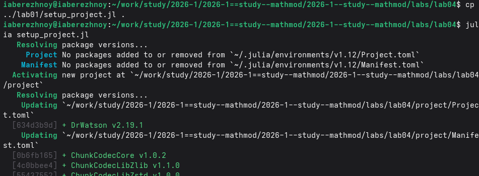
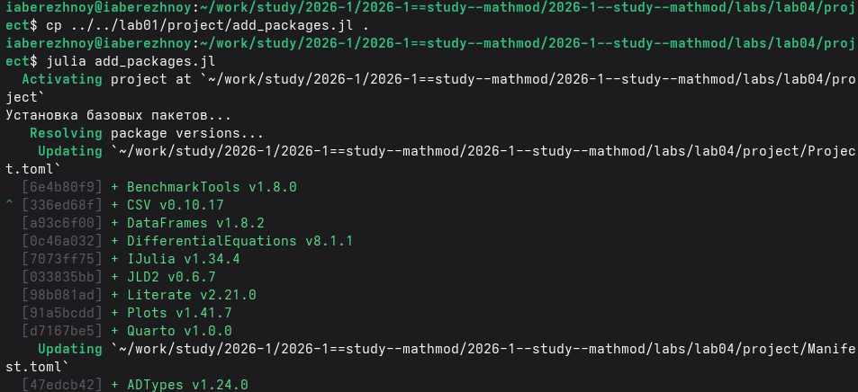
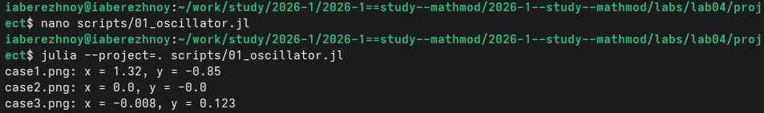
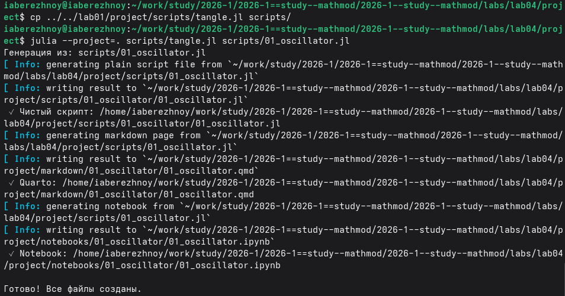
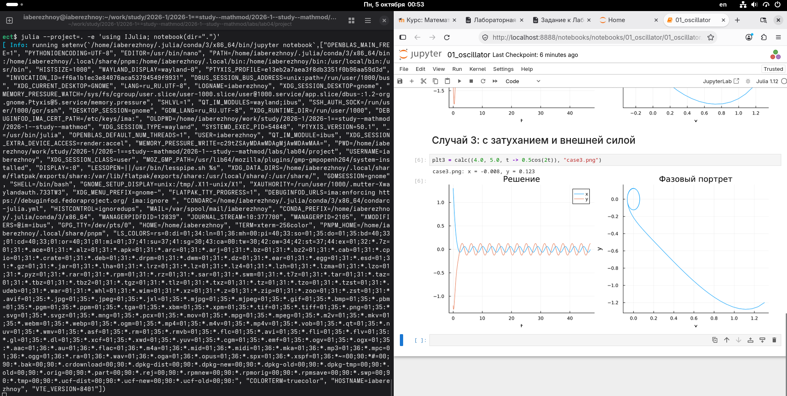
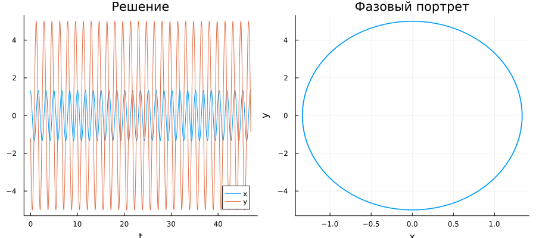
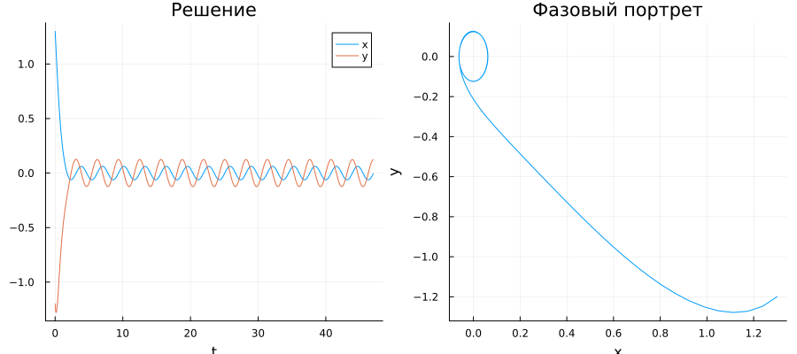

---
## Author
author:
  name: Иван Александрович Бережной
  email: 1132236041@rudn.ru
  affiliation:
    - name: Российский университет дружбы народов
      country: Российская Федерация
      postal-code: 117198
      city: Москва
      address: ул. Миклухо-Маклая, д. 6
## Title
title: "Отчёт по лабораторной работе №4"
subtitle: "Математическое моделирование"
license: "CC BY"
abstract: |
  В отчёте рассмотрена модель гармонических колебаний.
  
keywords: [лабораторная работа, Julia, гармонические колебания]
---

# Введение

## Цель работы

Построить модель гармонических колебаний и решить её на Julia.

## Задачи

Номер варианта: $(1132236041 \bmod 70) + 1 = 42$.

Построить решение и фазовый портрет гармонического осциллятора для 3 случаев:

- без затухания и внешней силы;
- с затуханием и без внешней силы;
- с затуханием и с внешней силой.

## Объект и предмет исследования

Объект --- гармонический осциллятор.

Предмет --- изменение его состояния во времени.

## Методы исследования

- Построение модели в виде системы дифференциальных уравнений.
- Численное решение системы.
- Анализ графиков и фазовых портретов.

## Схема выполнения работы

На рис. -@fig-flowchart представлена общая последовательность действий при выполнении работы.

::: {#fig-flowchart}

```{mermaid}
%%| fig-width: 100%
graph TD
    A@{ shape: circle, label: "Начало" } --> B[Записать уравнения]
    B --> C[Создать проект]
    C --> D[Написать скрипт]
    D --> E[Построить графики]
    E --> F[Сделать отчёт]
    F --> G@{ shape: dbl-circ, label: "Конец" }
```

Блок-схема выполнения лабораторной работы

:::

# Теоретическая часть

Описание модели взято из методических указаний [@mathmod_lab04].

Гармонический осциллятор --- это система, которая колеблется около положения равновесия. Примеры: грузик на пружине, маятник.

Обозначим $x$ --- отклонение, $y$ --- скорость. Уравнения моего варианта:

Случай 1. Без затухания и без внешней силы:

$$
\ddot{x} + 14x = 0
$$

Случай 2. С затуханием и без внешней силы:

$$
\ddot{x} + 2\dot{x} + 5x = 0
$$

Случай 3. С затуханием и с внешней силой:

$$
\ddot{x} + 4\dot{x} + 5x = 0.5\cos(2t)
$$

# Выполнение лабораторной работы

Создадим проект DrWatson (рис. -@fig-001).

{#fig-001 width=100%}

Добавим в проект пакеты (рис. -@fig-002).

{#fig-002 width=100%}

Напишем скрипт `scripts/01_oscillator.jl`. Он решает систему для 3 случаев и строит графики. Код скрипта представлен в приложении. Запустим его (рис. -@fig-003).

{#fig-003 width=100%}

Получим из скрипта чистый код, ноутбук и Quarto (рис. -@fig-004).

{#fig-004 width=100%}

Выполним ноутбук (рис. -@fig-005).

{#fig-005 width=100%}

# Результаты

Графики для трёх случаев представлены на рис. -@fig-006, -@fig-007 и -@fig-008.

{#fig-006 width=100%}

{#fig-007 width=100%}

{#fig-008 width=100%}

# Обсуждение результатов

В первом случае колебания не затухают. Фазовым портретом является замкнутая кривая.

Во втором случае колебания быстро гаснут. Фазовым портретом является спираль, которая сходится в центр.

В третьем случае после затухания остаются небольшие колебания, которые поддерживает внешняя сила. Фазовый портрет содержит маленькую замкнутую кривую.

# Ответы на вопросы

**Вопрос 1.** Простейшая модель гармонических колебаний:

$$
\ddot{x} + \omega_0^2 x = 0
$$

Здесь $x$ --- отклонение от положения равновесия, $\omega_0$ --- собственная частота.

**Вопрос 2.** Осциллятор --- это система, которая совершает колебания около положения равновесия.

**Вопрос 3.** Модель математического маятника:

$$
\ddot{\theta} + \frac{g}{L}\sin\theta = 0
$$

Здесь $\theta$ --- угол отклонения, $g$ --- ускорение свободного падения, $L$ --- длина маятника.

**Вопрос 4.** Вводим новую переменную $y = \dot{x}$. Первое уравнение: $\dot{x} = y$. Второе получаем из исходного уравнения, заменив $\ddot{x}$ на $\dot{y}$:

$$
\dot{x} = y, \qquad \dot{y} = -\omega_0^2 x
$$

**Вопрос 5.** Фазовая траектория --- кривая на плоскости $(x, y)$, которую описывает состояние системы со временем. Фазовый портрет --- набор фазовых траекторий для разных начальных условий.

# Заключение

Модель построена и решена, для трёх случаев получены решения и фазовые портреты.

# Список литературы {.unnumbered}

::: {#refs}
:::

\appendix


