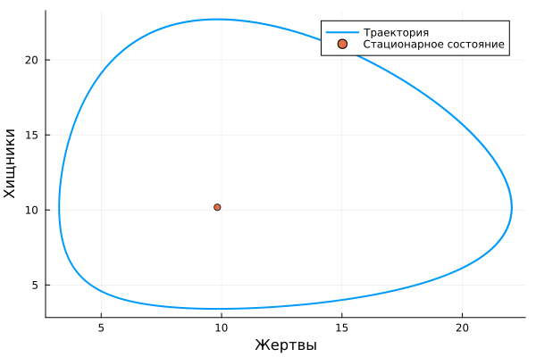

---
## Author
author:
  name: Иван Александрович Бережной
  email: 1132236041@rudn.ru
  affiliation:
    - name: Российский университет дружбы народов
      country: Российская Федерация
      postal-code: 117198
      city: Москва
      address: ул. Миклухо-Маклая, д. 6
## Title
title: "Презентация по лабораторной работе №5"
subtitle: "Математическое моделирование"
license: CC BY
date: today
date-format: "YYYY-MM-DD" # Example: 2025-09-06
---

# Информация

## Докладчик

  * Иван Александрович Бережной
  * студент
  * Российский университет дружбы народов им. П. Лумумбы
  * 1132236041@rudn.ru

::: notes
- Представиться.
:::

# Вводная часть

## Актуальность

- Модель описывает взаимодействие двух популяций: хищников и жертв.
- Она объясняет, почему численность популяций колеблется.

## Объект и предмет исследования

- Объект: две популяции, хищники и жертвы.

- Предмет: изменение численности популяций во времени.

## Цели и задачи

- Цель:
    - Построить модель хищник-жертва и решить её на Julia.
- Задачи: 
    - Построить графики изменения численности хищников и жертв.
    - Построить график зависимости численности хищников от численности жертв.
    - Найти стационарное состояние системы.

## Материалы и методы

Работа выполнялась на виртуальной машине с ОС Fedora.

Методы:

- Построение модели в виде системы дифференциальных уравнений.
- Численное решение системы.
- Анализ графиков.

# Выполнение работы

## Модель

$$
\frac{dx}{dt} = -0.56x + 0.057xy
$$

$$
\frac{dy}{dt} = 0.57y - 0.056xy
$$

Здесь $x$ --- число хищников, $y$ --- число жертв.

::: notes
- Изначально 11 хищников и 22 жертвы.
:::

## Стационарное состояние

Численности, при которых ничего не меняется:

$$
x_s = \frac{0.57}{0.056} \approx 10.179
$$

$$
y_s = \frac{0.56}{0.057} \approx 9.825
$$

::: notes
- Получается, если приравнять правые части уравнений к нулю.
:::

## Реализация модели

Проект создан с помощью DrWatson, скрипт `scripts/01_lotka.jl` выполнен в литературном стиле.

{width=100%}

::: notes
- Программа выводит стационарное состояние и строит два графика.
:::

# Результаты

## Изменение численности

Численности колеблются периодически.

{height=60%}

## Зависимость хищников от жертв

Замкнутая кривая вокруг стационарного состояния.

{height=60%}

# Заключение

## Главный вывод

Численности хищников и жертв колеблются периодически вокруг стационарного состояния.

::: notes
- Поблагодарить устно и перейти к вопросам.
:::

