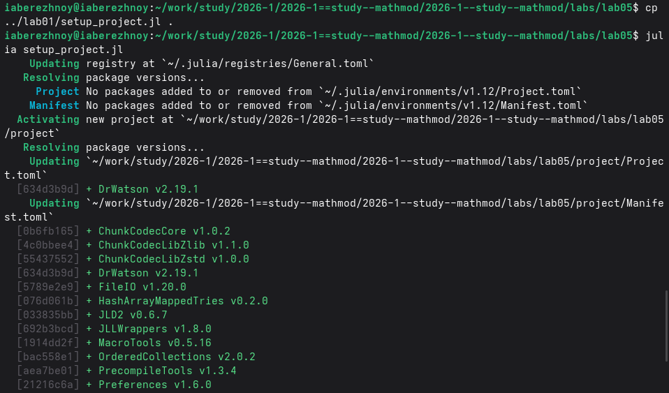
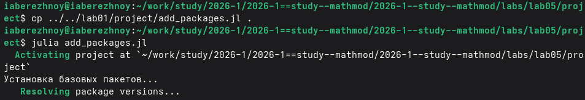
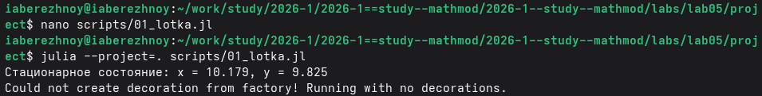
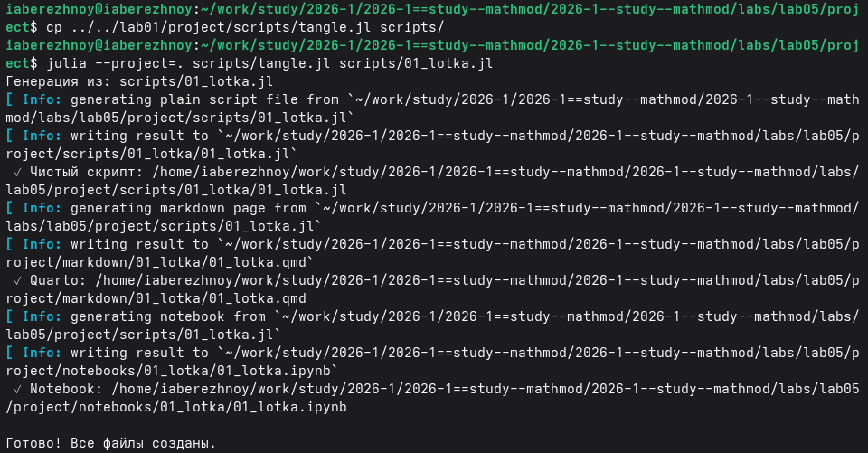
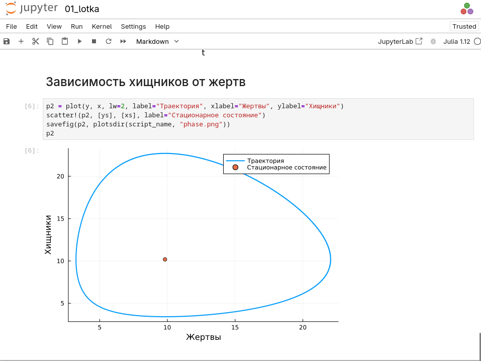
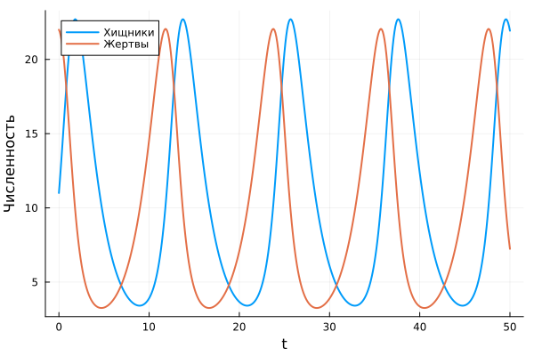

---
## Author
author:
  name: Иван Александрович Бережной
  email: 1132236041@rudn.ru
  affiliation:
    - name: Российский университет дружбы народов
      country: Российская Федерация
      postal-code: 117198
      city: Москва
      address: ул. Миклухо-Маклая, д. 6
## Title
title: "Отчёт по лабораторной работе №5"
subtitle: "Математическое моделирование"
license: "CC BY"
abstract: |
  В отчёте рассмотрена модель хищник-жертва.
  
keywords: [лабораторная работа, Julia, модель хищник-жертва]
---

# Введение

## Цель работы

Построить модель хищник-жертва и решить её на языке Julia.

## Задачи

Номер варианта: $(1132236041 \bmod 70) + 1 = 42$.

- Построить графики изменения численности хищников и жертв.
- Построить график зависимости численности хищников от численности жертв.
- Найти стационарное состояние системы.

## Объект и предмет исследования

Объект --- две популяции: хищники и жертвы.

Предмет --- изменение численности популяций во времени.

## Методы исследования

- Построение модели в виде системы дифференциальных уравнений.
- Численное решение системы.
- Анализ графиков.

## Схема выполнения работы

На рис. -@fig-flowchart представлена общая последовательность действий при выполнении работы.

::: {#fig-flowchart}

```{mermaid}
%%| fig-width: 100%
graph TD
    A@{ shape: circle, label: "Начало" } --> B[Записать уравнения]
    B --> C[Создать проект]
    C --> D[Написать скрипт]
    D --> E[Построить графики]
    E --> F[Сделать отчёт]
    F --> G@{ shape: dbl-circ, label: "Конец" }
```

Блок-схема выполнения лабораторной работы

:::

# Теоретическая часть

Описание модели взято из методических указаний [@mathmod_lab05].

Обозначим $x$ --- число хищников, $y$ --- число жертв. Система моего варианта:

$$
\frac{dx}{dt} = -0.56x + 0.057xy
$$

$$
\frac{dy}{dt} = 0.57y - 0.056xy
$$

Без жертв хищники вымирают, без хищников жертвы размножаются. Встречи хищников с жертвами увеличивают число хищников и уменьшают число жертв.

Стационарное состояние --- это численности, при которых ничего не меняется. Чтобы его найти, приравняем правые части к нулю:

$$
x_s = \frac{0.57}{0.056} \approx 10.179, \qquad y_s = \frac{0.56}{0.057} \approx 9.825
$$

# Выполнение лабораторной работы

Создадим проект DrWatson (рис. -@fig-001).

{#fig-001 width=100%}

Добавим в проект пакеты (рис. -@fig-002).

{#fig-002 width=100%}

Напишем скрипт `scripts/01_lotka.jl`. Он находит стационарное состояние, решает систему и строит графики. Код скрипта представлен в приложении. Запустим его (рис. -@fig-003).

{#fig-003 width=100%}

Получим из скрипта чистый код, ноутбук и Quarto (рис. -@fig-004).

{#fig-004 width=100%}

Выполним ноутбук (рис. -@fig-005).

{#fig-005 width=100%}

# Результаты

Изменение численности хищников и жертв показано на рис. -@fig-006.

{#fig-006 width=100%}

Зависимость численности хищников от численности жертв показана на рис. -@fig-007.

{#fig-007 width=100%}

Стационарное состояние: $x_s \approx 10.179$, $y_s \approx 9.825$.

# Обсуждение результатов

Численности хищников и жертв колеблются периодически. Сначала растёт число жертв, затем с задержкой растёт число хищников, что вполне логично.

Зависимость хищников от жертв --- замкнутая кривая. Система возвращается в исходное состояние, колебания не затухают.

Стационарное состояние лежит внутри этой кривой. Если начать из него, численности меняться не будут.

# Заключение

Модель построена и решена, получены графики и найдено стационарное состояние.

# Список литературы {.unnumbered}

::: {#refs}
:::

\appendix


