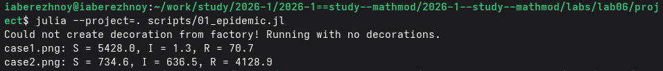
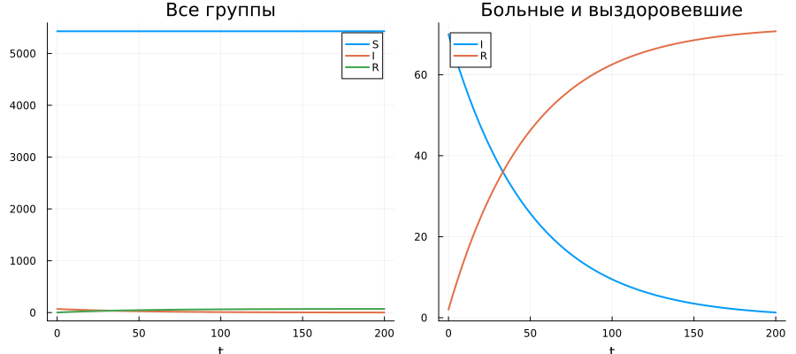

---
## Author
author:
  name: Иван Александрович Бережной
  email: 1132236041@rudn.ru
  affiliation:
    - name: Российский университет дружбы народов
      country: Российская Федерация
      postal-code: 117198
      city: Москва
      address: ул. Миклухо-Маклая, д. 6
## Title
title: "Презентация по лабораторной работе №6"
subtitle: "Математическое моделирование"
license: CC BY
date: today
date-format: "YYYY-MM-DD" # Example: 2025-09-06
---

# Информация

## Докладчик

  * Иван Александрович Бережной
  * студент
  * Российский университет дружбы народов им. П. Лумумбы
  * 1132236041@rudn.ru

::: notes
- Представиться.
:::

# Вводная часть

## Актуальность

- Модель показывает развитие эпидемии.
- Модель позволяет оценить влияние изоляции больных на ход эпидемии.

## Объект и предмет исследования

- Объект: эпидемия в изолированной популяции.

- Предмет: изменение количества людей в трёх группах во времени.

## Цели и задачи

- Цель:
    - Построить модель эпидемии и решить её на Julia.
- Задачи: 
    - Построить графики для случая, когда число больных не превышает критического.
    - Построить графики для случая, когда число больных превышает критическое.

## Материалы и методы

Работа выполнялась на виртуальной машине с ОС Fedora.

Методы:

- Построение модели в виде системы дифференциальных уравнений.
- Численное решение системы.
- Анализ графиков.

# Выполнение работы

## Модель

Население делится на три группы:

- $S$ --- здоровые, которые могут заразиться;
- $I$ --- больные, которые разносят заразу;
- $R$ --- здоровые, с иммунитетом.

В начале: $S = 5428$, $I = 70$, $R = 2$.

::: notes
- Всего на острове 5500 человек.
:::

## Случай 1: больные изолированы

$$
\frac{dS}{dt} = 0, \qquad \frac{dI}{dt} = -\beta I, \qquad \frac{dR}{dt} = \beta I
$$

::: notes
- Число больных не превышает критического, никто не заражается.
:::

## Случай 2: больные заражают здоровых

$$
\frac{dS}{dt} = -\alpha S, \qquad \frac{dI}{dt} = \alpha S - \beta I, \qquad \frac{dR}{dt} = \beta I
$$

Коэффициенты: $\alpha = 0.01$, $\beta = 0.02$

## Реализация модели

Проект создан с помощью DrWatson, скрипт `scripts/01_epidemic.jl` выполнен в литературном стиле.

{width=100%}

::: notes
- Программа выводит число людей в каждой группе в конце расчёта.
:::

# Результаты

## Случай 1

Эпидемия не развивается, больные выздоравливают.

{height=60%}

## Случай 2

Число больных достигает максимума около 1375 человек.

{height=60%}

# Заключение

## Главный вывод

Если больные изолированы, эпидемия не развивается. Без изоляции заражается большая часть населения.

::: notes
- Поблагодарить устно и перейти к вопросам.
:::

