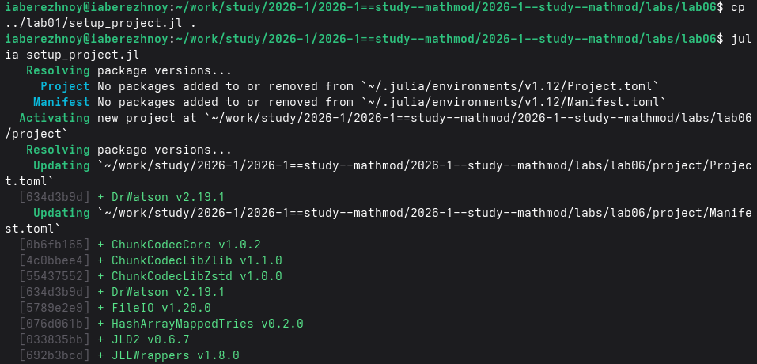
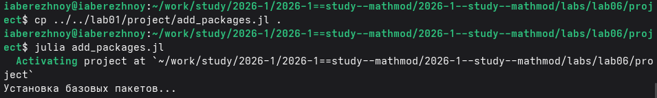
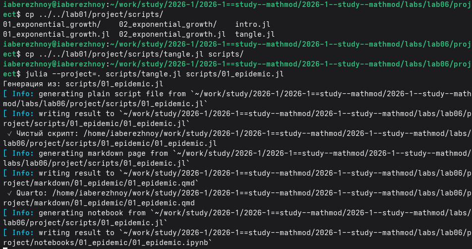
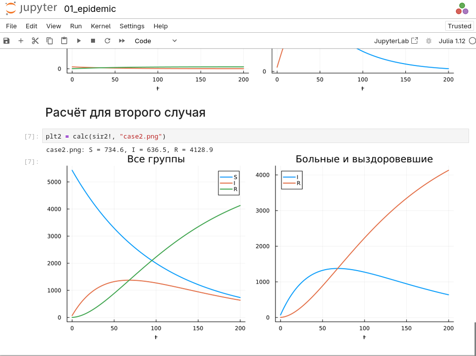
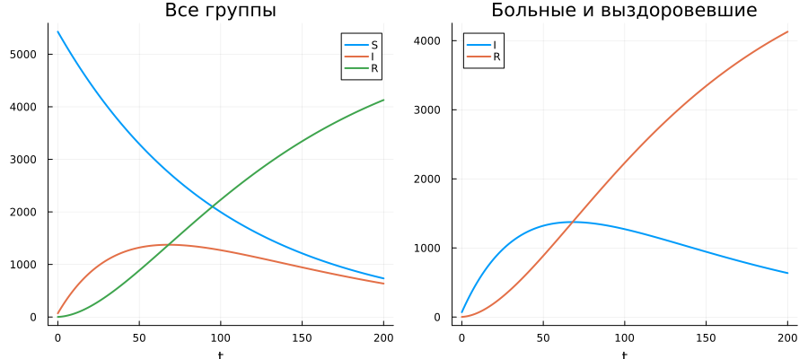

---
## Author
author:
  name: Иван Александрович Бережной
  email: 1132236041@rudn.ru
  affiliation:
    - name: Российский университет дружбы народов
      country: Российская Федерация
      postal-code: 117198
      city: Москва
      address: ул. Миклухо-Маклая, д. 6
## Title
title: "Отчёт по лабораторной работе №6"
subtitle: "Математическое моделирование"
license: "CC BY"
abstract: |
  В отчёте рассмотрена задача об эпидемии.
  
keywords: [лабораторная работа, Julia, задача об эпидемии]
---

# Введение

## Цель работы

Построить модель эпидемии и решить её на Julia.

## Задачи

Номер варианта: $(1132236041 \bmod 70) + 1 = 42$.

Условие: на острове живут 5500 человек. В начале эпидемии больных всего 70, людей с иммунитетом 2, остальные 5428 здоровы и могут заразиться.

Построить графики изменения числа людей в трёх группах для двух случаев:

- число больных не превышает критического значения;
- число больных превышает критическое значение.

## Объект и предмет исследования

Объект --- эпидемия в изолированной популяции.

Предмет --- изменение количества людей в трёх группах во времени. 

## Методы исследования

- Построение модели в виде системы дифференциальных уравнений.
- Численное решение системы.
- Анализ графиков.

## Схема выполнения работы

На рис. -@fig-flowchart представлена общая последовательность действий при выполнении работы.

::: {#fig-flowchart}

```{mermaid}
%%| fig-width: 100%
graph TD
    A@{ shape: circle, label: "Начало" } --> B[Записать уравнения]
    B --> C[Создать проект]
    C --> D[Написать скрипт]
    D --> E[Построить графики]
    E --> F[Сделать отчёт]
    F --> G@{ shape: dbl-circ, label: "Конец" }
```

Блок-схема выполнения лабораторной работы

:::

# Теоретическая часть

Описание модели взято из методических указаний [@mathmod_lab06].

Население делится на три группы:

- $S$ --- здоровые, которые могут заразиться;
- $I$ --- больные, которые разносят инфекцию;
- $R$ --- здоровые с иммунитетом.

Обозначим $\alpha$ --- коэффициент заболеваемости, $\beta$ --- коэффициент выздоровления, $I^*$ --- критическое число больных.

Случай 1. Если $I(0) \le I^*$, больные изолированы и никого не заражают:

$$
\frac{dS}{dt} = 0, \qquad \frac{dI}{dt} = -\beta I, \qquad \frac{dR}{dt} = \beta I
$$

Случай 2. Если $I(0) > I^*$, больные заражают здоровых:

$$
\frac{dS}{dt} = -\alpha S, \qquad \frac{dI}{dt} = \alpha S - \beta I, \qquad \frac{dR}{dt} = \beta I
$$

Коэффициенты выбраны самостоятельно: $\alpha = 0.01$, $\beta = 0.02$. Время от 0 до 200.

# Выполнение лабораторной работы

Создадим проект DrWatson (рис. -@fig-001).

{#fig-001 width=100%}

Добавим в проект пакеты (рис. -@fig-002).

{#fig-002 width=100%}

Напишем скрипт `scripts/01_.epidemic.jl`. Он решает систему для двух случаев и строит графики. Код скрипта представлен в приложении. Запустим его (рис. -@fig-003).

{#fig-003 width=100%}

Получим из скрипта чистый код, ноутбук и Quarto (рис. -@fig-004).

{#fig-004 width=100%}

Выполним ноутбук (рис. -@fig-005).

{#fig-005 width=100%}

# Результаты

График для первого случая показан на рис. -@fig-006, для второго --- на рис. -@fig-007.

{#fig-006 width=100%}

{#fig-007 width=100%}

Число людей в каждой группе в конце расчёта приведено в табл. -@tbl-result.

|Случай|S|I|R|
|:--:|:--:|:--:|:--:|
|1|5428.0|1.3|70.7|
|2|734.6|636.5|4128.9|

: Результаты расчёта {#tbl-result}

# Обсуждение результатов

В первом случае эпидемия не развивается. Число здоровых не меняется. Больные постепенно выздоравливают.

Во втором случае здоровые быстро заражаются. Число больных растёт и доходит до пика в 1375 человек, затем снижается. А число людей с иммунитетом всё время растёт.

Изоляция больных полностью останавливает эпидемию.

# Заключение

Модель построена и решена, для двух случаев построены графики изменения числа людей в трёх группах.

# Список литературы {.unnumbered}

::: {#refs}
:::

\appendix


