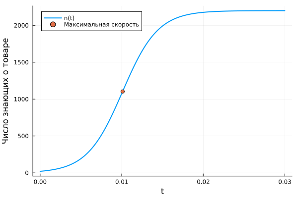

---
## Author
author:
  name: Иван Александрович Бережной
  email: 1132236041@rudn.ru
  affiliation:
    - name: Российский университет дружбы народов
      country: Российская Федерация
      postal-code: 117198
      city: Москва
      address: ул. Миклухо-Маклая, д. 6
## Title
title: "Презентация по лабораторной работе №7"
subtitle: "Математическое моделирование"
license: CC BY
date: today
date-format: "YYYY-MM-DD" # Example: 2025-09-06
---

# Информация

## Докладчик

  * Иван Александрович Бережной
  * студент
  * Российский университет дружбы народов им. П. Лумумбы
  * 1132236041@rudn.ru

::: notes
- Представиться.
:::

# Вводная часть

## Актуальность

- Модель показывает, как быстро аудитория узнаёт о товаре.
- Модель позволяет сравнить платную рекламу и сарафанное радио.

## Объект и предмет исследования

- Объект: рекламная кампания.

- Предмет: изменения числа людей, знающих о товаре.

## Цели и задачи

- Цель:
    - Построить модель распространения рекламы и решить её на Julia.
- Задачи: 
    - Построить графики распространения рекламы для 3 случаев.
    - Для второго случая найти момент времени, когда скорость распространения максимальна.

## Материалы и методы

Работа выполнялась на виртуальной машине с ОС Fedora.

Методы:

- Построение модели в виде системы дифференциального уравнения.
- Численное решение уравнения.
- Анализ графиков.

# Выполнение работы

## Модель

$$
\frac{dn}{dt} = (\alpha_1 + \alpha_2 n)(N - n)
$$

- $n$ --- число людей, знающих о товаре;
- $N = 2200$ --- объём аудитории;
- $\alpha_1$ --- платная реклама;
- $\alpha_2$ --- сарафанное радио

::: notes
- Вначале о товаре знают 21 человек.
:::

## Три случая

$$
\frac{dn}{dt} = (0.605 + 0.000017n)(N - n)
$$

$$
\frac{dn}{dt} = (0.000065 + 0.209n)(N - n)
$$

$$
\frac{dn}{dt} = (0.51\sin t + 0.31tn)(N - n)
$$

::: notes
- В первом преобладает платная реклама, во втором сарафанное радио, в третьем коэффициенты зависят от времени.
:::

## Реализация модели

Проект создан с помощью DrWatson, скрипт `scripts/01_advert.jl` выполнен в литературном стиле.

{width=100%}

::: notes
- Программа выводит момент максимальной скорости для каждого случая.
:::

# Результаты

## Случай 1: платная реклама

Быстрее всего реклама распространяется в самом начале.

{height=60%}

## Случай 2: сарафанное радио

Скорость максимальна при $t \approx 0.0101$.

{height=60%}

## Случай 3: коэффициенты зависят от времени

Скорость максимальна при $t \approx 0.1182$.

{height=60%}

# Заключение

## Главный вывод

Сарафанное радио распространяет рекламу быстрее платной рекламы. Скорость максимальна, когда о товаре знают около половины аудитории.

::: notes
- Поблагодарить устно и перейти к вопросам.
:::

