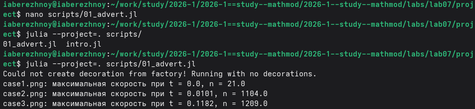
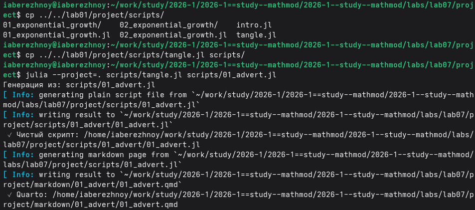
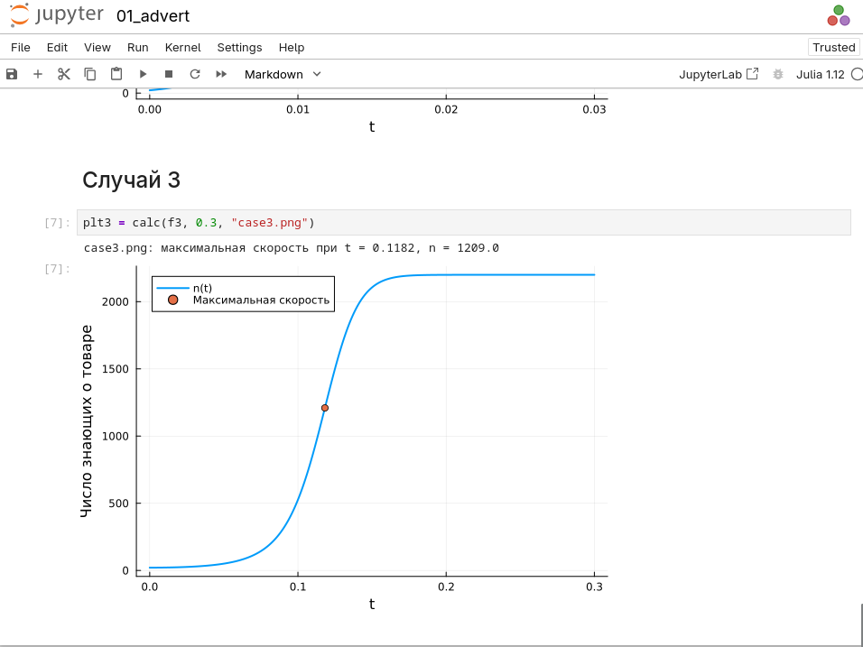
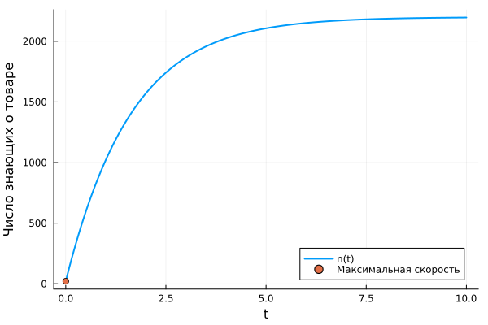
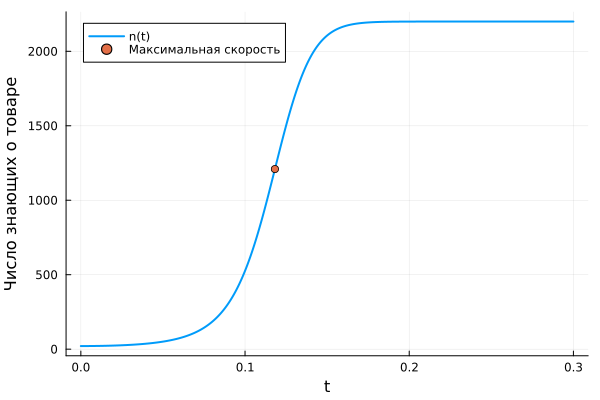

---
## Author
author:
  name: Иван Александрович Бережной
  email: 1132236041@rudn.ru
  affiliation:
    - name: Российский университет дружбы народов
      country: Российская Федерация
      postal-code: 117198
      city: Москва
      address: ул. Миклухо-Маклая, д. 6
## Title
title: "Отчёт по лабораторной работе №7"
subtitle: "Математическое моделирование"
license: "CC BY"
abstract: |
  В отчёте рассмотрена модель эффективности рекламы.
  
keywords: [лабораторная работа, Julia, эффективность рекламы]
---

# Введение

## Цель работы

Построить модель распространения рекламы и решить её на Julia.

## Задачи

Номер варианта: $(1132236041 \bmod 70) + 1 = 42$.

Условие: объём аудитории $N = 2200$, в начальный момент о товаре знает 21 человек.

- Построить графики распространения рекламы для 3 случаев.
- Для второго случая найти момент времени, когда скорость распространения максимальна.

## Объект и предмет исследования

Объект --- рекламная компания.

Предмет --- изменения числа людей, знающих о товаре.

## Методы исследования

- Построение модели в виде системы дифференциальных уравнений.
- Численное решение системы.
- Анализ графиков.

## Схема выполнения работы

На рис. -@fig-flowchart представлена общая последовательность действий при выполнении работы.

::: {#fig-flowchart}

```{mermaid}
%%| fig-width: 100%
graph TD
    A@{ shape: circle, label: "Начало" } --> B[Записать уравнения]
    B --> C[Создать проект]
    C --> D[Написать скрипт]
    D --> E[Построить графики]
    E --> F[Сделать отчёт]
    F --> G@{ shape: dbl-circ, label: "Конец" }
```

Блок-схема выполнения лабораторной работы

:::

# Теоретическая часть

Описание модели взято из методических указаний [@mathmod_lab07].

Обозначим $n$ --- число людей, знающих о товаре, $N$ --- общее число потенциальных покупателей. Число знающих растёт двумя путями:

- платная реклама, её силу задаёт коэффициент $\alpha_1$;
- сарафанное радио, его силу задаёт коэффициент $\alpha_2$.

Общий вид уравнения:

$$
\frac{dn}{dt} = (\alpha_1 + \alpha_2 n)(N - n)
$$

Случай 1. Преобладает платная реклама:

$$
\frac{dn}{dt} = (0.605 + 0.000017n)(N - n)
$$

Случай 2. Преобладает сарафанное радио:

$$
\frac{dn}{dt} = (0.000065 + 0.209n)(N - n)
$$

Случай 3. Коэффициенты зависят от времени:

$$
\frac{dn}{dt} = (0.51\sin t + 0.31tn)(N - n)
$$

# Выполнение лабораторной работы

Проект DrWatson создан так же, как в предыдущих работах, т.е. с помощью скриптов `setup_project.jl` и `add_packages.jl`.

Напишем скрипт `scripts/01_advert.jl`. Он решает уравнение для трёх случаев, находит момент максимальной скорости и строит графики. Код скрипта представлен в литературном стиле и содержится в приложении. Запустим его (рис. -@fig-001).

{#fig-001 width=100%}

Получим из скрипта чистый код, ноутбук и Quarto (рис. -@fig-002).

{#fig-002 width=100%}

Выполним ноутбук (рис. -@fig-003).

{#fig-003 width=100%}

# Результаты

Графики для трёх случаев показаны на рис. -@fig-004, -@fig-005 и -@fig-006. Точкой отмечен момент максимальной скорости.

{#fig-004 width=100%}

{#fig-005 width=100%}

{#fig-006 width=100%}

Момент максимальной скорости распространения приведён в табл. -@tbl-result.

|Случай|Время|Число знающих|
|:--:|:--:|:--:|
|1|0.0|21|
|2|0.0101|1104|
|3|0.1182|1209|

: Момент максимальной скорости распространения рекламы {#tbl-result}

# Обсуждение результатов

В первом случае реклама быстрее всего распространяется в самом начале. Затем рост замедляется, поскольку незнающих становится всё меньше.

Во втором случае кривая имеет вид буквы S. Сначала знающих мало и рост медленный, затем, когда о товаре знает больше людей, рост ускоряется, и пик приходится на $t \approx 0.0101$.

В третьем случае кривая похожа на вторую, но рост начинается позже.

Сарафанное радио распространяет информацию намного быстрее платной рекламы: во втором случае вся аудитория узнаёт о товаре за сотые доли единицы времени.

# Ответы на вопросы

**Вопрос 1.** Модель Мальтуса:

$$
\frac{dx}{dt} = ax
$$

Она описывает рост, скорость которого пропорциональна текущему значению. Используется для описания роста численности популяции при неограниченных ресурсах.

**Вопрос 2.** Уравнение логистической кривой:

$$
\frac{dx}{dt} = ax\left(1 - \frac{x}{K}\right)
$$

Оно описывает рост с насыщением: сначала рост быстрый, затем замедляется и останавливается.

**Вопрос 3.** Коэффициенты $\alpha_1$ и $\alpha_2$ задают интенсивность платной рекламы и интенсивность сарафанного радио соответственно.

**Вопрос 4.** При $\alpha_1 \gg \alpha_2$ получается модель типа модели Мальтуса. Число знающих быстро растёт с самого начала и постепенно выходит на насыщение.

**Вопрос 5.** При $\alpha_1 \ll \alpha_2$ получается логистическая краивая. Сначала рост медленный, затем быстрый, после снова медленный.

# Заключение

Модель построена и решена. Для трёх случаев получены графики и найден момент максимальной скорости распространения рекламы.

# Список литературы {.unnumbered}

::: {#refs}
:::

\appendix


