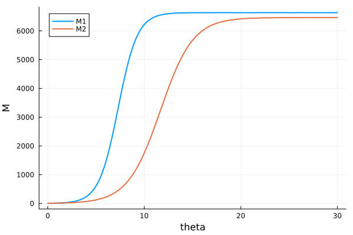

---
## Author
author:
  name: Иван Александрович Бережной
  email: 1132236041@rudn.ru
  affiliation:
    - name: Российский университет дружбы народов
      country: Российская Федерация
      postal-code: 117198
      city: Москва
      address: ул. Миклухо-Маклая, д. 6
## Title
title: "Презентация по лабораторной работе №8"
subtitle: "Математическое моделирование"
license: CC BY
date: today
date-format: "YYYY-MM-DD" # Example: 2025-09-06
---

# Информация

## Докладчик

  * Иван Александрович Бережной
  * студент
  * Российский университет дружбы народов им. П. Лумумбы
  * 1132236041@rudn.ru

::: notes
- Представиться.
:::

# Вводная часть

## Актуальность

- Фирмы с одинаковым товаром конкурируют за одних покупателей.
- Модель показывает, кто останется на рынке.
- Можно проверить влияние предпочтений покупателей.

## Объект и предмет исследования

- Объект: две фирмы, которые продают одинаковый товар.

- Предмет: изменение их оборотных средств во времени.

## Цели и задачи

- Цель:
    - Построить модель конкуренции двух фирм и посмотреть, как меняются их оборотные средства.
- Задачи: 
    - Построить графики оборотных средств двух фирм для случая 1.
    - Построить графики оборотных средств двух фирм для случая 2.
    - Найти стационарное состояние для случая 1.

## Материалы и методы

Работа выполнялась на виртуальной машине с ОС Fedora.

Методы:

- Построение модели в виде системы дифференциальных уравнений.
- Численное решение системы.
- Анализ графиков.

# Выполнение работы

## Модель, случай 1

$$
\frac{dM_1}{d\theta} = M_1 - \frac{b}{c_1} M_1 M_2 - \frac{a_1}{c_1} M_1^2
$$

$$
\frac{dM_2}{d\theta} = \frac{c_2}{c_1} M_2 - \frac{b}{c_1} M_1 M_2 - \frac{a_2}{c_1} M_2^2
$$

::: notes
- Первое слагаемое --- рост, второе --- конкуренция, третье --- ограниченность рынка.
:::

## Модель, случай 2

Меняется только второе уравнение:

$$
\frac{dM_2}{d\theta} = \frac{c_2}{c_1} M_2 - \left(\frac{b}{c_1} + 0.00022\right) M_1 M_2 - \frac{a_2}{c_1} M_2^2
$$

::: notes
Добавка 0.00022 означает, что покупатели предпочитают товар первой фирмы.
:::

## Данные варианта 42

- $p_{cr} = 24$, $N = 54$, $q = 1$
- $\tau_1 = 24$, $\tau_2 = 20$
- $\tilde{p}_1 = 7.4$, $\tilde{p}_2 = 11.4$
- $M_1(0) = 4.5$, $M_2(0) = 6.5$

# Результаты

## Случай 1

{height=60%}

::: notes
- Обе фирмы растут и выходят на постоянный уровень.
:::

## Случай 2

{height=60%}

::: notes
- Первая фирма растёт как раньше, вторая упала до нуля.
:::

## Стационарное состояние

$$
a_1 M_1 + b M_2 = c_1, \quad b M_1 + a_2 M_2 = c_2
$$

- $M_1 = 6633.24$
- $M_2 = 6463.59$

::: notes
Производные приравняли к нулю. Результат совпал с графиком первого случая.
:::

# Заключение

## Главный вывод

Построена модель конкуренции двух фирм. В первом случае обе фирмы остаются на рынке, во втором случае вторая фирма становится банкротом.

::: notes
- Поблагодарить устно и перейти к вопросам.
:::

