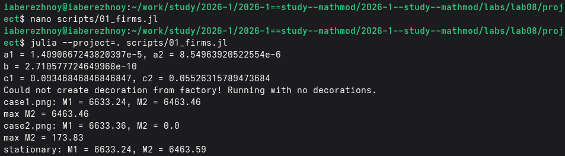
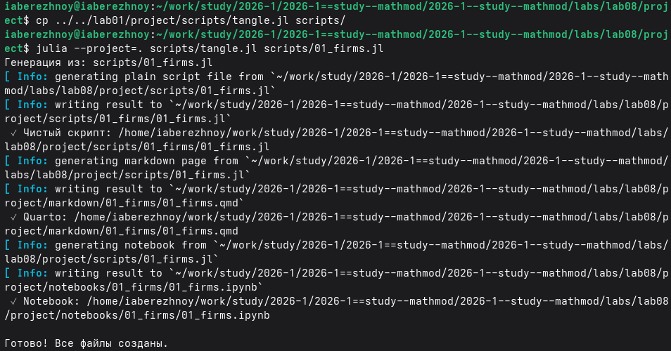
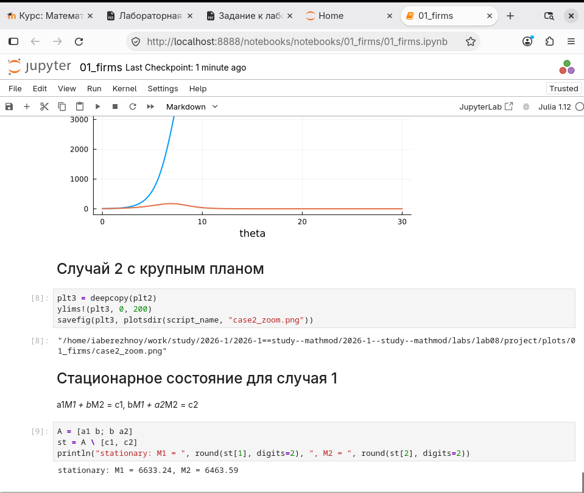
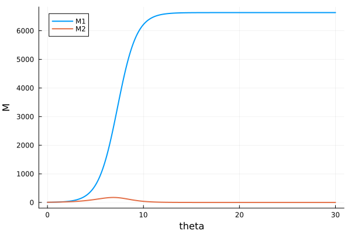
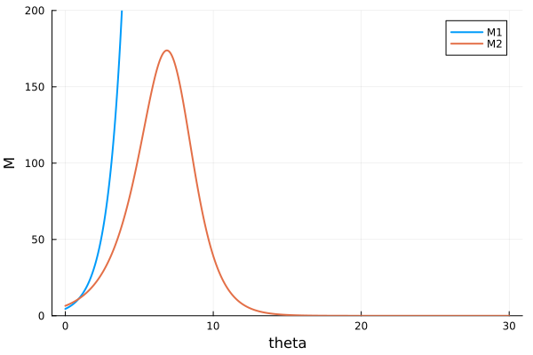

---
## Author
author:
  name: Иван Александрович Бережной
  email: 1132236041@rudn.ru
  affiliation:
    - name: Российский университет дружбы народов
      country: Российская Федерация
      postal-code: 117198
      city: Москва
      address: ул. Миклухо-Маклая, д. 6
## Title
title: "Отчёт по лабораторной работе №8"
subtitle: "Математическое моделирование"
license: "CC BY"
abstract: |
  В работе построена модель конкуренции двух фирм для варианта 42.
  Рассмотрены два случая и найдено стационарное состояние.
  
keywords: [лабораторная работа, Julia, конкуренция фирм, оборотные средства]
---

# Введение

## Цель работы

Построить модель конкуренции двух фирм и посмотреть, как меняются их оборотные средства.

## Задачи

Номер варианта: $(1132236041 \bmod 70) + 1 = 42$.

- Построить графики оборотных средств двух фирм для случая 1.
- Построить графики оборотных средств двух фирм для случая 2.
- Найти стационарное состояние для случая 1.

## Объект и предмет исследования

Объект --- две фирмы, которые продают одинаковый товар.

Предмет --- изменение их оборотных средств во времени.

## Методы исследования

- Построение модели в виде системы дифференциальных уравнений.
- Численное решение системы.
- Анализ графиков.

## Схема выполнения работы

На рис. -@fig-flowchart представлена общая последовательность действий при выполнении работы.

::: {#fig-flowchart}

```{mermaid}
%%| fig-width: 100%
graph TD
    A@{ shape: circle, label: "Начало" } --> B[Записать уравнения]
    B --> C[Создать проект]
    C --> D[Написать скрипт]
    D --> E[Построить графики]
    E --> F[Сделать отчёт]
    F --> G@{ shape: dbl-circ, label: "Конец" }
```

Блок-схема выполнения лабораторной работы

:::

# Теоретическая часть

Модель описана в [@mathmod_lab08]. Пусть $M_1$ и $M_2$ --- оборотные средства первой и второй фирмы. Время безразмерное: $\theta = t / c_1$.

Случай 1. Конкуренция только рыночная:

$$
\frac{dM_1}{d\theta} = M_1 - \frac{b}{c_1} M_1 M_2 - \frac{a_1}{c_1} M_1^2,
$$

$$
\frac{dM_2}{d\theta} = \frac{c_2}{c_1} M_2 - \frac{b}{c_1} M_1 M_2 - \frac{a_2}{c_1} M_2^2.
$$

Случай 2. Покупатели предпочитают товар первой фирмы. Первое уравнение то же, а второе меняется:

$$
\frac{dM_2}{d\theta} = \frac{c_2}{c_1} M_2 - \left(\frac{b}{c_1} + 0.00022\right) M_1 M_2 - \frac{a_2}{c_1} M_2^2.
$$

Коэффициенты:

$$
a_1 = \frac{p_{cr}}{\tau_1^2 \tilde{p}_1^2 N q}, \quad
a_2 = \frac{p_{cr}}{\tau_2^2 \tilde{p}_2^2 N q}, \quad
b = \frac{p_{cr}}{\tau_1^2 \tilde{p}_1^2 \tau_2^2 \tilde{p}_2^2 N q},
$$

$$
c_1 = \frac{p_{cr} - \tilde{p}_1}{\tau_1 \tilde{p}_1}, \quad
c_2 = \frac{p_{cr} - \tilde{p}_2}{\tau_2 \tilde{p}_2}.
$$

Здесь $p_{cr}$ --- критическая цена товара, $N$ --- число потребителей, $q$ --- потребность одного человека, $\tau$ --- длительность производственного цикла, $\tilde{p}$ --- себестоимость.

Данные варианта 42: $p_{cr} = 24$, $N = 54$, $q = 1$, $\tau_1 = 24$, $\tau_2 = 20$, $\tilde{p}_1 = 7.4$, $\tilde{p}_2 = 11.4$. Начальные условия: $M_1(0) = 4.5$, $M_2(0) = 6.5$.

Первое слагаемое в каждом уравнении --- это рост фирмы. Слагаемое с $M_1 M_2$ --- конкуренция. Слагаемое с квадратом --- ограниченность рынка.

# Выполнение лабораторной работы

Создадим проект DrWatson и напишем скрипт `scripts/01_firms.jl`. Запустим его (рис. -@fig-001).

{#fig-001 width=100%}

Получим из скрипта чистый код, ноутбук и Quarto (рис. -@fig-002).

{#fig-002 width=100%}

Выполним ноутбук (рис. -@fig-003).

{#fig-003 width=100%}

# Результаты

Случай 1 показан на рис. -@fig-004. Обе фирмы растут и выходят на постоянный уровень.

{#fig-004 width=80%}

Случай 2 показан на рис. -@fig-005. Первая фирма растёт, а вторая почти не видна.

{#fig-005 width=80%}

На рис. -@fig-006 тот же график крупным планом. Вторая фирма слегка растёт, затем падает до нуля.

{#fig-006 width=80%}

Значения в конце расчёта при $\theta = 30$ собраны в табл. -@tbl-result.

|Случай|$M_1$|$M_2$|Максимум $M_2$|
|:--:|:--:|:--:|:--:|
|1|6633.24|6463.46|6463.46|
|2|6633.36|0.0|173.83|

: Результаты расчёта {#tbl-result}

Стационарное состояние для случая 1. Приравниваем производные к нулю и сокращаем на $M_1$ и $M_2$:

$$
a_1 M_1 + b M_2 = c_1, \quad b M_1 + a_2 M_2 = c_2.
$$

Решение этой системы: $M_1 = 6633.24$, $M_2 = 6463.59$.

# Обсуждение результатов

В 1 случае коэф. конкуренции мал, из-за чего фирмы почти не мешают друг другу. Каждая растёт до своего предела, и обе остаются на рынке.

Во 2 случае коэф. конкуренции для второй фирмы стал больше. Пока первая фирма маленькая, вторая растёт. Когда первая вырастает, вторая начинает терять средства и банкротится. Первая фирма остаётся на рынке.

Таким образом, небольшое предпочтение покупателей может полностью менять исход конкуренции.

# Заключение

Построена модель конкуренции двух фирм. В 1-ом случае обе фирмы сосуществуют, во 2-ом случае вторая фирмы становится банкротом, а первая занимает весь рынок. Стационарное состояние для случая 1: $M_1 = 6633.24$, $M_2 = 6463.59$.

# Список литературы {.unnumbered}

::: {#refs}
:::

\appendix


